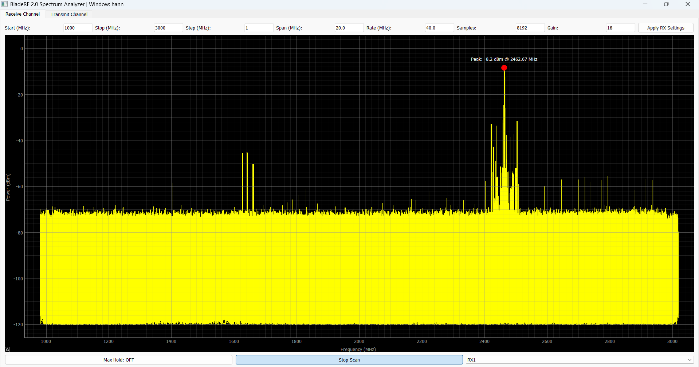
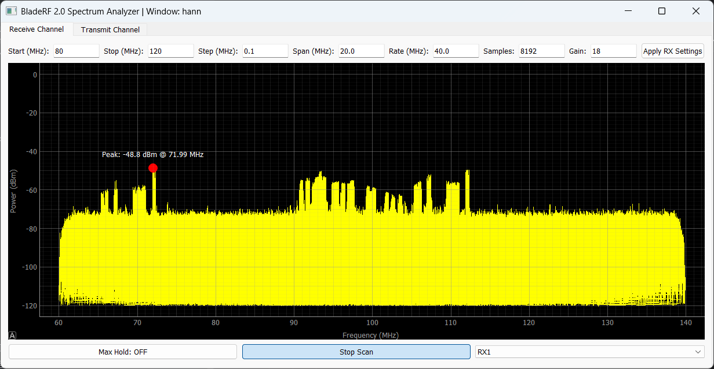
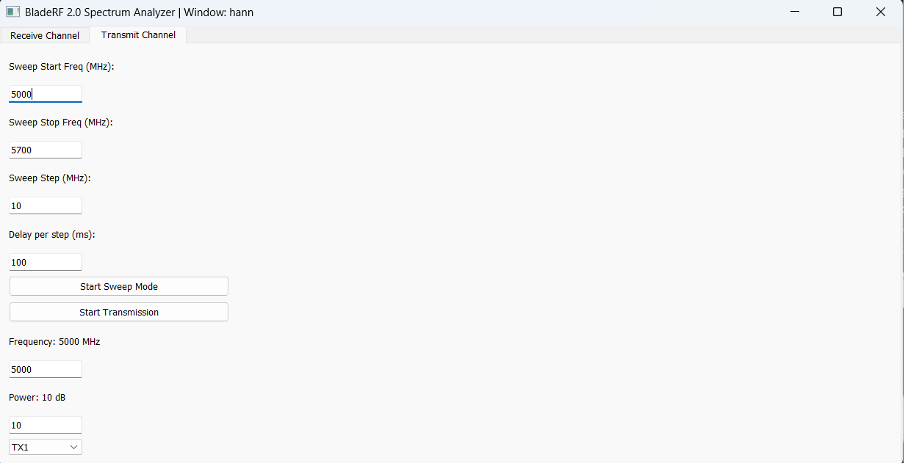

# Real-Time Wideband Spectrum Analyzer and Signal Generator with BladeRF

This project is a real-time wideband spectrum analyzer and signal generator built using the [BladeRF 2.0](https://www.nuand.com/bladerf-2-0-micro/) software-defined radio and Python. 

## Features

- Real-time spectrum display that allows wideband scan (75-6000MHz)
- Adjustable gain and FFT window settings and frequency range
- "Max Hold" mode for capturing peak values
- Switching between Rx1/Rx2 and Tx1/Tx2 channels
- Highlighting max point on graph
- TX/RX mode switching
- Logging of all console output to a log file
- Tx mode that allows you to transmit at sweep and classical modes

## Future updates
- Waterfall mode
- Faster algorithms

## Important!
In wideband scanning it is possible that displayed spectrum  will have frequency shift compared to real signal (due to digital processing in SDR). To compensate that, there is calibration data in main.py (self.calibration_table) where you can add frequency shifts.

